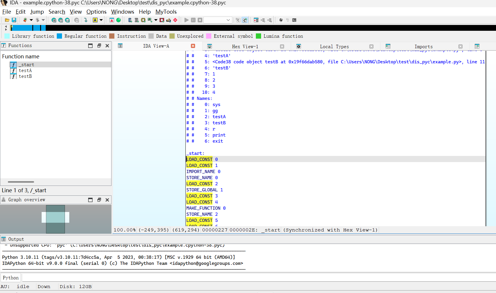

# ida-pyc

**".pyc"  python 字节码文件分析插件 for IDA Pro.**

* 在  IDA Pro 9.0,  xdis==6.1.3,  uncompyle6==3.9.2 上测试通过

* 支持的python字节码版本从  python1 到 python3 (与 'xdis' 模块一致)

* 对于python3的字节码增加额外特性（如交叉引用等） (更多旧版本字节码会加入，如果 ...)

  

### 安装

1. 安装python依赖 

   ```python
   pip install xdis
   pip install uncompyle6
   ```

   

2. 复制文件/文件夹到IDA Pro安装目录

```bash
cp loaders/pyc-loader.py  ${YOU_IDA_HOME_DIR}/loaders/
cp procs/pyc-proc.py  ${YOU_IDA_HOME_DIR}/procs/
cp -r procs/pyc-procs  ${YOU_IDA_HOME_DIR}/procs/
```


### 使用





**按 Ctrl+F5 或 Alt+F5 反编译 pyc 文件**

**按 e 或 鼠标双击 进行代码修改**
