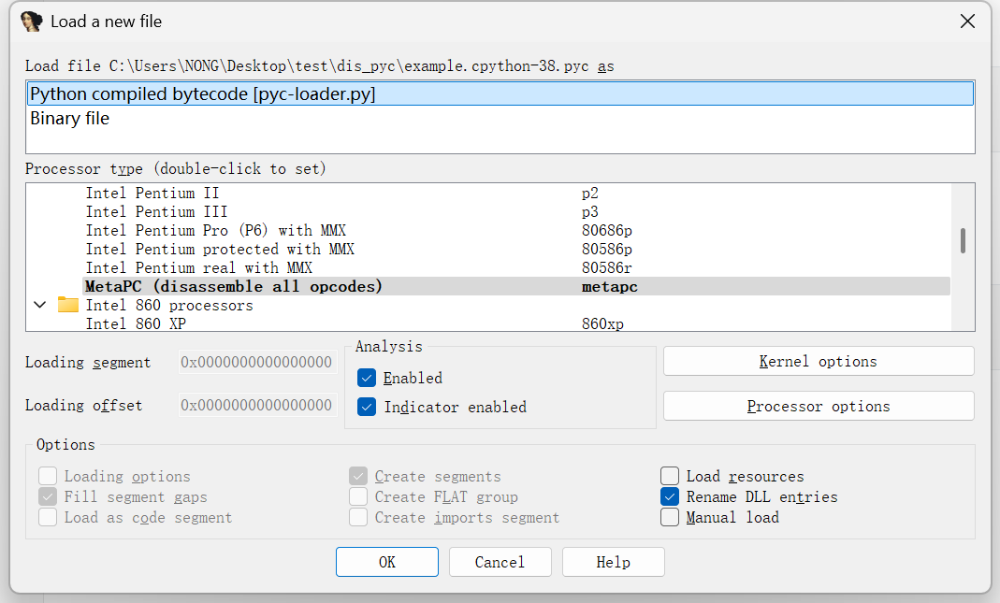
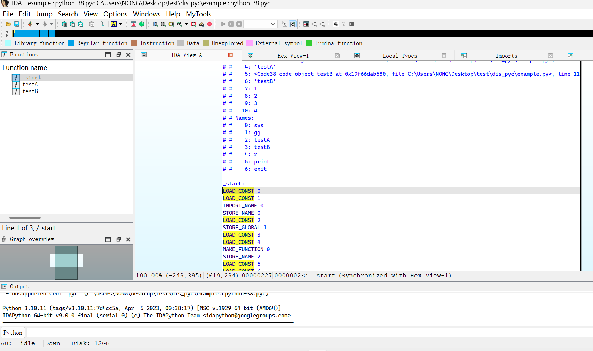

# ida-pyc

**".pyc"  python compiled byte code analysis  plugin for IDA Pro.**

* tested on  IDA Pro 9.0,  xdis==6.1.3,  uncompyle6==3.9.2

  

### Installation

1. install the depends 

   ```python
   pip install xdis
   pip install uncompyle6
   ```

   

2. copy files to IDA Pro directories

```bash
cp loaders/pyc-loader.py  ${YOU_DIR_HOME_DIR}/loaders/
cp procs/pyc-proc.py  ${YOU_DIR_HOME_DIR}/procs/
```


### Usage





**press Ctrl+F5 to decompile the pyc file**
